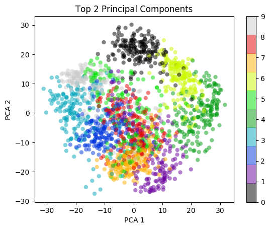
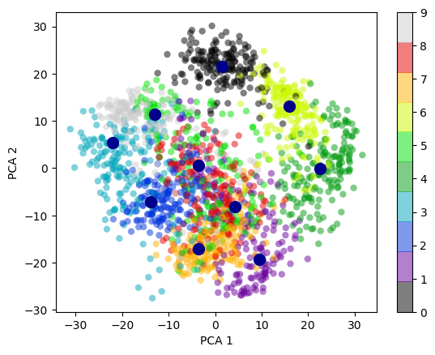

This is the last and concluding part of my series on 'Practical Machine Learning with
R and Python'. In this series I  included the implementations of the most common
Machine Learning algorithms in R and equivalent Python code. In touched upon
the following ML algorithms in
 

1. [Practical Machine Learning with R and Python - Part 1](https://gigadom.wordpress.com/2017/10/06/practical-machine-learning-with-r-and-python-part-1/)
In this initial post, I touch upon regression of a continuous target variable. Specifically I touch upon Univariate, Multivariate, Polynomial regression and KNN regression in both R and Python
2. [Practical Machine Learning with R and Python - Part 2](https://gigadom.wordpress.com/2017/10/13/practical-machine-learning-with-r-and-python-part-2/)
In this post, I discuss Logistic Regression, KNN classification and Cross Validation error for both LOOCV and K-Fold in both R and Python 
3. [Practical Machine Learning with R and Python - Part 3](https://gigadom.wordpress.com/2017/10/20/practical-machine-learning-with-r-and-python-part-3/)
This 3rd part included 'feature selection' in Machine Learning. Specifically I touch best fit, forward fit, backward fit, ridge(L2 regularization) & lasso (L1 regularization). The post includes equivalent code in R and Python. 
4. [Practical Machine Learning with R and Python - Part 4](https://gigadom.wordpress.com/2017/10/29/practical-machine-learning-with-r-and-python-part-4/)
In this part I discussed SVMs, Decision Trees, Validation, Precision-Recall, AUC and  ROC curves
5. [Practical Machine Learning with R and Python - Part 5](https://gigadom.wordpress.com/2017/11/07/practical-machine-learning-with-r-and-python-part-5/)
In this penultimate part I touch upon B-splines, natural splines, smoothinf spline,
Generalized Additive Models, Decision Trees, Random Forests and Gradient Boosted Trees.

In this last part I cover Unsupervised Learning. Specifically I cover the implementations
of Principal Component Analysis (PCA). K-Means and Heirachical Clustering

```{r}
library(dplyr)
library(ggplot2)
#Note: This example is based on the example in the book Python Datascience handbook by 
# Jake VanderPlas
digits= read.csv("digits.csv")
# Digits target
digitClasses <- factor(digits$X0.000000000000000000e.00.29)
digitsPCA=prcomp(digits[,1:64])

df <- data.frame(digitsPCA$x)
df1 <- cbind(df,digitClasses)
#Plot only the first 2 Principal components as a scatter plot
ggplot(df1,aes(x=PC1,y=PC2,col=digitClasses)) + geom_point() +
  ggtitle("Top 2 Principal Components")


```

```{r}
digits= read.csv("digits.csv")
# Digits target
digitClasses <- factor(digits$X0.000000000000000000e.00.29)
digitsPCA=prcomp(digits[,1:64])
# Plot the percent variance exlained with the number of principal components
# Get the Standard Deviation
digitsPCA$sdev
# Compute the variance
digitsVar=digitsPCA$sdev^2
#Compute the percent variance explained
percentVarExp=digitsVar/sum(digitsVar)


plot(cumsum(percentVarExp), xlab="Principal Component", 
     ylab="Cumulative Proportion of Variance Explained", 
     main="Principal Components vs % Variance explained",ylim=c(0,1),type='l',lwd=2,
       col="blue")
```


```{python}
import numpy as np
from sklearn.decomposition import PCA
from sklearn import decomposition
from sklearn import datasets
import matplotlib.pyplot as plt
  
from sklearn.datasets import load_digits
digits = load_digits()
digits.data.shape
pca = PCA(2)  # project from 64 to 2 dimensions
projected = pca.fit_transform(digits.data)


plt.scatter(projected[:, 0], projected[:, 1],
            c=digits.target, edgecolor='none', alpha=0.5,
            cmap=plt.cm.get_cmap('spectral', 10))
plt.xlabel('component 1')
plt.ylabel('component 2')
plt.colorbar();
plt.title("op 2 Principal Components")
plt.savefig('fig1.png', bbox_inches='tight')
```


```{python}
import numpy as np
from sklearn.decomposition import PCA
from sklearn import decomposition
from sklearn import datasets
import matplotlib.pyplot as plt
  
from sklearn.datasets import load_digits
digits = load_digits()
pca = PCA(64)  # project from 64 to 2 dimensions
projected = pca.fit_transform(digits.data)
varianceExp= pca.explained_variance_ratio_
totVarExp=np.cumsum(np.round(pca.explained_variance_ratio_, decimals=4)*100)
totVarExp
plt.plot(totVarExp)
plt.xlabel('No of principal components')
plt.ylabel('% variance explained')
plt.title('No of Principal Components vs Total Variance explained')
plt.savefig('fig2.png', bbox_inches='tight')
```


```{r}
digits= read.csv("digits.csv")
# Digits target
digitClasses <- factor(digits$X0.000000000000000000e.00.29)
digitsPCA=prcomp(digits[,1:64])

df <- data.frame(digitsPCA$x)
df1 <- cbind(df,digitClasses)

# Pick only the first 2 principal components
a<- df[,1:2]
# Compute K Means of 10 clusters
k<-kmeans(a,10,1000)

# Create a dataframe of the centroids of the clusters
df2<-data.frame(k$centers)

#Plot the first 2 principal components with the K Means
ggplot(df1,aes(x=PC1,y=PC2,col=digitClasses)) + geom_point() +
    geom_point(data=df2,aes(x=PC1,y=PC2),col="black",size = 4) + 
    ggtitle("Top 2 Principal Components with KMeans clustering") 
```

```{python}
import numpy as np
from sklearn.decomposition import PCA
from sklearn import decomposition
from sklearn import datasets
import matplotlib.pyplot as plt
from sklearn.datasets import load_digits
from sklearn.cluster import KMeans
digits = load_digits()

pca = PCA(2)  # project from 64 to 2 dimensions
projected = pca.fit_transform(digits.data)

kmeans = KMeans(n_clusters=10)

kmeans.fit(projected)
y_kmeans = kmeans.predict(projected)
y_kmeans
centers = kmeans.cluster_centers_
centers

plt.scatter(projected[:, 0], projected[:, 1],
            c=digits.target, edgecolor='none', alpha=0.5,
            cmap=plt.cm.get_cmap('spectral', 10))
plt.xlabel('component 1')
plt.ylabel('component 2')
plt.colorbar();

plt.scatter(centers[:, 0], centers[:, 1], c='darkblue', s=100)
plt.savefig('fig3.png', bbox_inches='tight')
```




```{r}
iris <- datasets::iris
iris2 <- iris[,-5]
species <- iris[,5]
d_iris <- dist(iris2) # method="man" # is a bit better

d_iris <- dist(iris)
hc_iris <- hclust(d_iris, method = "average")
plot(hc_iris)
# Cut tree into 4 groups
sub_grp <- cutree(hc_iris, k = 3)

# Number of members in each cluster
table(sub_grp)

rect.hclust(hc_iris, k = 3, border = 2:5)

```


```{python}
from sklearn.datasets import load_iris
import matplotlib.pyplot as plt
from scipy.cluster.hierarchy import dendrogram, linkage
iris = load_iris()


# generate the linkage matrix
Z = linkage(iris.data, 'average')
dendrogram(Z)
plt.xlabel('Data')
plt.ylabel('Distance')
plt.suptitle('Samples clustering', fontweight='bold', fontsize=14);


plt.savefig('fig4.png', bbox_inches='tight')
```


**References**

1. [Statistical Learning](https://lagunita.stanford.edu/courses/HumanitiesandScience/StatLearning/Winter2015/about), Prof Trevor Hastie & Prof Robert Tibesherani, Online Stanford
2. [Applied Machine Learning in Python](https://www.coursera.org/learn/python-machine-learning) Prof Kevyn-Collin Thomson, University Of Michigan, Coursera